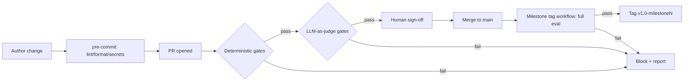

# Contributing Guide

This document defines how we use Git, how work moves through milestones, and the
automated gates every specification and generated artifact must pass before it is
accepted. The goals are: **one source of truth, reproducible regeneration,
controlled rollback, and automated (deterministic + LLM-based) quality gates.**

---

## 1. Repository Model

- **One repository.** Never clone the repo to snapshot a "version." Use branches
  and tags. Creating parallel repository copies is an anti-pattern.
- **`main` is the source of truth.** It must always be buildable and releasable.
- **Trunk-based development.** Prefer short-lived branches integrated frequently
  over long-lived divergent branches.

```
main ──●──●──●──●──●──●──●──●──●──────►  (always releasable)
        \          \          \
         milestone/m1  milestone/m2  milestone/m3   (frozen snapshots)
```

---

## 2. Branch Types

| Branch pattern      | Purpose                                   | Lifetime            |
|---------------------|-------------------------------------------|---------------------|
| `main`              | Source of truth, always releasable        | Permanent           |
| `feature/<id>-desc` | A single unit of work / ticket            | Days — deleted after merge |
| `milestone/<mN>`    | Frozen milestone you must keep patching   | Cut from `main`; hotfix only |
| `hotfix/<mN>-<n>`   | Urgent fix on a milestone snapshot        | Short-lived         |
| `generated/<mN>`    | Regenerated artifacts under review        | Short-lived, PR-gated |
| `recovery/from-<mN>`| Rollback working branch from a tag        | As needed           |

**Rule of thumb: _tag to remember, branch to continue._** Do not create a
milestone branch that never receives commits — use a tag instead.

---

## 3. Tags & Milestones

Milestones are marked with **annotated tags** (immutable pointers), and only
promoted to branches if ongoing commits are required.

```bash
git tag -a v1.0-milestone1 -m "Milestone 1: baseline generation"
git push origin v1.0-milestone1
```

### Tag naming conventions

| Convention                 | Example                  | Use                         |
|----------------------------|--------------------------|-----------------------------|
| `v<major>.<minor>-milestone<N>` | `v1.0-milestone2`   | Milestone snapshot          |
| `nightly/<YYYY-MM-DD>`     | `nightly/2026-07-06`     | Blessed nightly build       |
| `hotfix/<mN>-<n>`          | `hotfix/m2-1`            | Milestone hotfix            |

### Retention policy

- Keep **all** milestone tags.
- Keep the last **14** nightly tags; prune older ones to avoid clutter.

---

## 4. Feature Workflow

1. Branch from `main`: `git checkout -b feature/REQ-014-add-validation`.
2. Commit small, focused changes. Local hooks run automatically (see §7).
3. Open a Pull Request to `main`.
4. All required gates must pass (deterministic + LLM judge + traceability).
5. Obtain required human review sign-off.
6. Merge (squash or rebase for linear history). Delete the branch.

Keep feature branches alive **days, not weeks** — the longer they diverge, the
more painful integration becomes.

---

## 5. Specifications & Traceability

Every requirement is identified by a stable ID (e.g., `REQ-014`) threaded through
spec → generated code → tests → evaluation rubric.

### Required spec fields

A spec change is **rejected by CI** unless each changed requirement includes:

- `success_criteria` — measurable definition of done.
- `validation_mechanism` — how the criteria are verified (test, check, or judge rubric).

```
spec/REQ-014.yaml ──► success_criteria + validation_mechanism (required)
        │
        ├─► generated/module.ts   // @traces REQ-014
        ├─► tests/req-014.test.ts
        └─► eval/rubric.jsonl      { "id": "REQ-014", "check": "..." }
```

### Traceability manifest

A committed manifest maps each `REQ-*` to its validating checks and downstream
artifacts. CI asserts that every changed requirement has (a) success criteria,
(b) at least one validating test or judge rubric entry, and (c) a downstream
artifact reference. Changing a requirement flags stale downstream artifacts so
regeneration is **scoped, not blind**.

---

## 6. Quality Gates

Nothing advances to `main` or a milestone tag until it passes the gates below.
Deterministic gates run **first** (cheap, reliable); LLM-based gates run **second**
(only on changes that already pass deterministic checks).

| Stage           | Git trigger          | Gate                                      | Blocking |
|-----------------|----------------------|-------------------------------------------|----------|
| Local authoring | pre-commit hook      | Lint, format, secret scan                 | Local    |
| Spec change     | PR to `main`         | Schema + success-criteria presence        | Yes      |
| Code generation | PR / CI              | Deterministic checks + LLM judge          | Yes      |
| Milestone cut   | tag workflow         | Full acceptance-criteria evaluation       | Yes      |
| Nightly         | scheduled workflow   | Regression + LLM correctness sweep        | Tag only if pass |



### 6.1 Deterministic gates (run first)

- Linting & formatting.
- Consistency checks: spec schema validation, naming conventions, cross-reference
  integrity (every referenced ID exists).
- Build + unit/integration tests must pass.
- Traceability check (§5).
- Secret & dependency scanning.

### 6.2 LLM-as-a-judge gates (run second)

Used for semantic correctness, completeness, and criteria satisfaction that
deterministic checks cannot assess.

- **Rubric-based prompts.** Provide the spec, success criteria, and artifact.
  Require per-criterion verdicts (`pass` / `fail` / `needs-review`) with cited
  justification, emitted as **JSON** for machine gating.
- **Deterministic settings.** Temperature 0; pin and record the model version in
  run metadata (same discipline as pinning generator versions).
- **Ensemble for high-stakes gates.** At milestone gates, run multiple samples or
  models and require majority agreement.
- **Calibrate against a golden set** of known-good/known-bad artifacts; treat
  judge drift as a regression.
- **Always emit an artifact** — the judge's JSON verdict + reasoning is attached
  to the PR or tag for audit.
- **Human-in-the-loop threshold.** Auto-pass high-confidence, auto-fail clear
  failures, route ambiguous scores to required human review.

> The LLM judge is a **gate, not an oracle.** Deterministic tests remain
> authoritative for anything testable; the judge covers the gap and must never
> override a failing test.

---

## 7. Local Hooks vs. CI Enforcement

- **Client hooks** (`pre-commit`) exist for speed and early feedback. They can be
  bypassed (`--no-verify`), so they are **not** authoritative.
- **CI workflows + branch protection** are the authoritative enforcement layer.
  Required status checks include deterministic gates, the LLM-judge job, and the
  traceability check.

---

## 8. Regeneration Workflow

1. A requirement change lands as a **spec PR** → traceability gate forces updated
   success criteria + validation.
2. **Impact detection**: CI diffs changed `REQ-*` IDs against the traceability
   manifest and lists stale generated artifacts.
3. **Scoped regeneration**: regenerate only affected artifacts using a pinned,
   deterministic generator version (recorded in the commit/manifest).
4. **Gate the output**: deterministic checks + LLM judge evaluate against the
   **new** criteria.
5. **Milestone gate**: cutting the milestone tag runs the full acceptance-criteria
   evaluation; the tag is created **only** if every gate passes.
6. **Nightly sweep**: full regression + LLM correctness run on `main`; blessed
   runs receive a `nightly/<date>` tag as a known-good rollback point.

Keep generated output reproducible: the same input commit + tool version must
reproduce the same output. Do not commit large generated binaries repeatedly —
use CI artifacts, Git LFS, or an artifact registry.

---

## 9. Rollback

Prefer **forward-moving, non-destructive** rollback so history stays auditable.

| Scenario                              | Command                                             | Notes                              |
|---------------------------------------|-----------------------------------------------------|------------------------------------|
| Undo a merged change on a shared branch | `git revert <sha>`                                | New commit; safe, preserves history |
| Return to a known-good milestone      | `git checkout -b recovery/from-m2 v1.0-milestone2`  | Branch off the tag                 |
| Local, unpublished mistake            | `git reset --hard <sha>`                            | **Only** for un-pushed commits     |

Rollback target is always the **last tag whose gates passed** (milestone or
blessed nightly).

---

## 10. Nightly Builds

- Build `main` each night; run regression + LLM correctness sweep.
- On success, create a `nightly/<date>` tag and retain the artifact — building a
  catalog of known-good rollback points.

```
main ──●──●──●──●──►
       │  │  │  │
     tag tag tag tag   nightly/2026-07-03 ... 2026-07-06
```

---

## 11. Anti-Patterns to Avoid

- ❌ Multiple repo copies / "repo per version" — use tags and branches.
- ❌ Long-lived divergent branches — integrate frequently.
- ❌ Force-pushing shared history (`git push --force` on `main`/`milestone/*`) —
  use `git revert`.
- ❌ Snapshot branches that never receive commits — use tags.
- ❌ Committing large generated binaries repeatedly — use artifacts/LFS.
- ❌ Treating an eternal `staging` branch as an environment — promote the same
  commit/tag through environments.
- ❌ Letting the LLM judge override failing deterministic tests.

---

## 12. Branch Protection Checklist

For `main` and `milestone/*`:

- [ ] Require Pull Requests before merging.
- [ ] Require passing status checks: deterministic gates, LLM-judge job,
      traceability check.
- [ ] Require review sign-off.
- [ ] Block force-pushes and branch deletion.
- [ ] Enforce linear history (optional but recommended).
- [ ] Milestone tag workflow self-aborts (fails job, deletes tag) if any gate fails.
