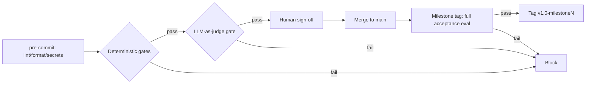

# Milestone-Gated AI Development Pipeline

This repository template implements a **milestone-based Git workflow with automated
quality gates** — deterministic checks plus **LLM-as-a-judge** evaluation — so that
specifications and AI-generated code are only accepted when they pass defined,
traceable success criteria.

> **Note:** A different `README.md` already existed in this folder, so this
> documentation lives in `PIPELINE_README.md`. When you move these files into your
> repository, rename this to `README.md` (or merge it) as appropriate.

See [CONTRIBUTING.md](CONTRIBUTING.md) for the full Git branching strategy, gate
architecture, and rollback/regeneration policy. This document covers **how the
pieces fit together and how to run them**.

---

## Contents

| Path | What it is |
|------|------------|
| [CONTRIBUTING.md](CONTRIBUTING.md) | Branching strategy, milestones, gates, rollback, anti-patterns |
| [.pre-commit-config.yaml](.pre-commit-config.yaml) | Local hooks: hygiene, secrets, lint/format, spec + traceability gates |
| [schemas/spec.schema.json](schemas/spec.schema.json) | JSON Schema requiring `success_criteria` + `validation_mechanism` per requirement |
| [scripts/check_traceability.py](scripts/check_traceability.py) | Deterministic gate: schema + REQ → artifact → validator traceability |
| [scripts/llm_judge.py](scripts/llm_judge.py) | LLM-as-a-judge gate (ensemble, rubric-based, offline fallback) |
| [.github/workflows/quality-gates.yml](.github/workflows/quality-gates.yml) | CI: deterministic → blocking judge → milestone acceptance |
| [spec/REQ-014.yaml](spec/REQ-014.yaml) | Example requirement specification |
| [eval/rubric.jsonl](eval/rubric.jsonl) | Example judge rubric entry |
| [generated/create_user.js](generated/create_user.js) | Example generated artifact (`@traces REQ-014`) |
| [tests/req_014_validation.test.js](tests/req_014_validation.test.js) | Example validating tests |
| [eval/traceability.json](eval/traceability.json) | Traceability manifest (REQ → validators → artifacts) |

---

## How it fits together

```
spec/REQ-014.yaml ──► success_criteria + validation_mechanism (REQUIRED by schema)
        │
        ├─► generated/create_user.js      // @traces REQ-014
        ├─► tests/req_014_validation.test.js
        └─► eval/rubric.jsonl              { "id": "REQ-014", "checks": [...] }
                    │
                    ▼
        eval/traceability.json  (manifest: REQ → validators → artifacts)
```

Every requirement gets a stable ID (`REQ-014`) threaded through the spec, the
generated code (via a `@traces REQ-014` comment), its tests, and the judge rubric.
This makes requirement changes **scoped and traceable**: change a REQ and the
gates know exactly what to re-evaluate.

### Gate order (cheap → expensive)



1. **Deterministic gates run first** — lint, format, secret scan, spec schema,
   traceability, build, tests. Cheap and reliable; they fail fast before any
   tokens are spent.
2. **LLM judge runs second** — only on changes that already passed deterministic
   checks. It evaluates semantic correctness against each success criterion.
3. **Milestone acceptance** — a tag is created only if the full evaluation passes;
   otherwise the tag is deleted.

---

## Prerequisites

- **Python 3.12+** with `pyyaml` and `jsonschema`:
  ```powershell
  pip install pyyaml jsonschema pre-commit
  ```
- **Node.js 18+** (for the example tests; swap in your own stack's runner).
- **pre-commit** (optional locally, recommended): `pip install pre-commit`.

---

## Quick start

From the repository root:

```powershell
# 1. Deterministic gate: validate specs + traceability
python scripts/check_traceability.py --root .

# 2. LLM-as-judge gate (offline mode by default — no credentials needed)
python scripts/llm_judge.py --root . --all --samples 3

# 3. Run the example tests
node --test tests/req_014_validation.test.js
```

Expected output (verified):

```
Traceability gate passed: 1 spec file(s) validated.
LLM judge overall verdict: PASS
  REQ-014: pass
# pass 3  # fail 0
```

The judge writes a machine-readable verdict to
`eval/results/verdict.json` (per-criterion pass/fail + justification + model +
run metadata) for audit.

---

## Step-by-step: add a new requirement

1. **Write the spec** in `spec/REQ-XXX.yaml`. The schema **requires**:
   - `id` (`REQ-XXX`), `title`, `description`, `status`
   - `success_criteria` — at least one measurable `AC-x` item
   - `validation_mechanism` — at least one `test` / `check` / `llm_judge` entry
   ```yaml
   id: REQ-020
   title: ...
   description: ...
   status: draft
   success_criteria:
     - id: AC-1
       statement: ...
       measure: ...
   validation_mechanism:
     - type: test
       ref: tests/req_020.test.js
       criteria_ids: [AC-1]
   downstream_artifacts:
     - generated/feature_020.js
   ```

2. **Generate / write the artifact** in `generated/` and add a trace comment:
   ```js
   // @traces REQ-020
   ```

3. **Add validating tests** at the path named in `validation_mechanism.ref`.

4. **(Optional) Add a judge rubric** line to `eval/rubric.jsonl` keyed by the REQ id:
   ```json
   {"id": "REQ-020", "checks": ["..."]}
   ```

5. **Update the manifest** `eval/traceability.json` (or let CI flag it).

6. **Run the gates locally** (Quick start above) before opening a PR.

---

## Running as Git hooks

```powershell
pre-commit install          # enable hooks
pre-commit run --all-files  # run every hook now
```

> **Note:** local hooks are for fast feedback and are **bypassable**
> (`git commit --no-verify`). The authoritative enforcement is CI + branch
> protection — see below.

---

## CI & branch protection

The workflow [.github/workflows/quality-gates.yml](.github/workflows/quality-gates.yml)
defines three jobs:

| Job | When | Blocks |
|-----|------|--------|
| `deterministic` | PR / push | lint, format, secrets, schema, traceability, build, tests |
| `llm-judge` | after `deterministic` passes | rubric-based ensemble judge; fails on any `fail`/unsigned `needs-review` |
| `milestone-acceptance` | on `v*milestone*` tags | full evaluation; **deletes the tag** if it fails |

**Required setup:**

1. In **branch protection** for `main` and `milestone/*`, mark
   `deterministic`, `llm-judge`, and `milestone-acceptance` as **required status
   checks**, require a review, and block force-pushes.
2. Add repository **secrets** `LLM_API_KEY` and `LLM_ENDPOINT`, and (optionally)
   repository **variables** `LLM_JUDGE_MODEL` and `LLM_JUDGE_SAMPLES`.

---

## LLM judge: offline vs. live mode

`scripts/llm_judge.py` runs in **offline mode by default** — a deterministic
token-overlap heuristic — so the pipeline is runnable end-to-end without
credentials or network access. This keeps CI green while you wire up a provider.

To use a **live model**, set `LLM_API_KEY` + `LLM_ENDPOINT` and implement the
marked section in `call_model()`:

- Use **temperature 0** for determinism.
- **Pin the model version** and record it in the verdict (already emitted).
- Keep `--samples >= 3` for an **ensemble majority vote** on high-stakes gates.
- Force **JSON-only** structured output: `{"verdict": ..., "justification": ...}`.

### Judge decision rules

- Any criterion `fail` → requirement `fail` → overall `fail` (blocks).
- Any criterion `needs-review` (and none `fail`) → requirement `needs-review`.
- A `needs-review` requirement is downgraded to `pass` only if it is listed in
  `eval/human-signoff.json` under `approved` — this is the **human-in-the-loop**
  threshold.
- The judge is a **gate, not an oracle**: it never overrides a failing
  deterministic test.

Example `eval/human-signoff.json`:
```json
{ "approved": { "REQ-014": true } }
```

---

## Regeneration & rollback (summary)

- **Requirement changes** land as spec PRs; the traceability gate forces updated
  success criteria + validation before generation proceeds.
- **Scoped regeneration**: only artifacts tracing the changed REQ are rebuilt,
  using a pinned generator version, then re-gated.
- **Milestones** are annotated tags; a tag is blessed only when the full
  acceptance evaluation passes.
- **Rollback** targets the last tag whose gates passed; use `git revert` on shared
  branches, never force-push.

Full details in [CONTRIBUTING.md](CONTRIBUTING.md).

---

## Customizing for your stack

- **Build/test commands**: edit the `deterministic` job in the workflow (it
  currently auto-detects Node and Python).
- **Linters/formatters**: adjust the tool hooks in `.pre-commit-config.yaml`.
- **Spec fields**: extend `schemas/spec.schema.json` (keep `success_criteria` and
  `validation_mechanism` required).
- **Trace annotation**: the pattern is `@traces REQ-\d{3,}` — change it in both
  `scripts/check_traceability.py` and `scripts/llm_judge.py` if you use a
  different convention.
